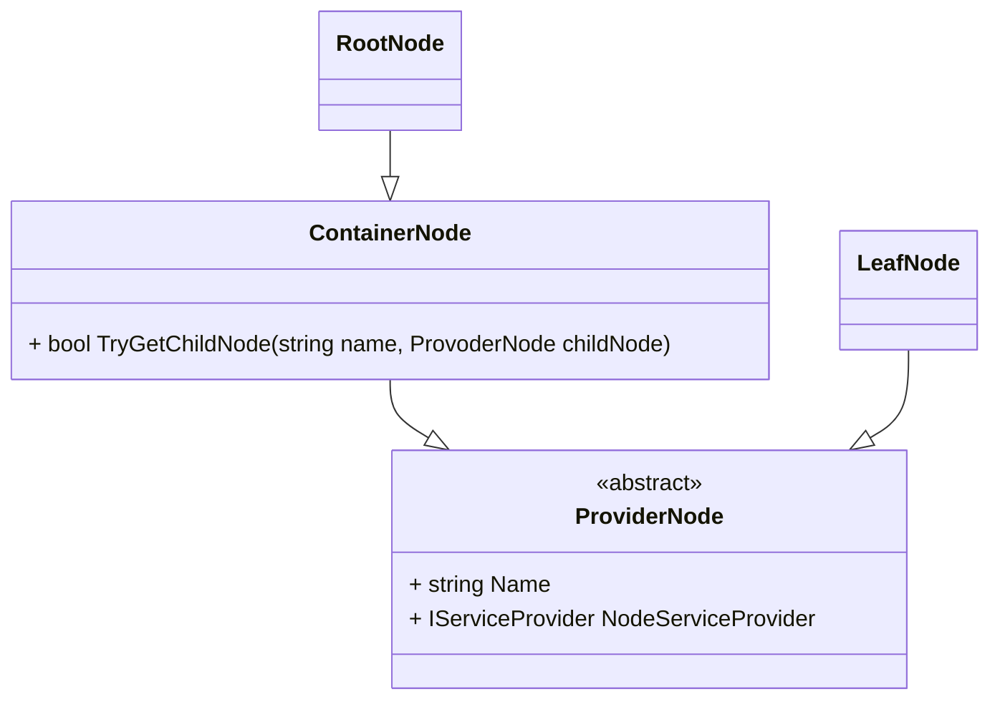
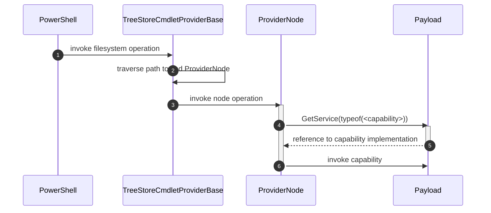

# TreeStore.Core

A C# Framework to help building PowerShell Command providers. TreeStore is meant to cover the common PowerShell concepts of a file  system aa hierarchical data structure of named items while the user (implementer of a concrete file system) can concentrate on the domain aspects of these nodes. 

## Building the project

Simply build the solution. 

The project references  a current version of the PowerShell SDK . The project also targets net8.0 instead netstandard 2.0 and is therefore not portable between PS 5.1 and PS 7. Support of the older platform would require to change the code from C# 11 to C# 7.3 which is quite some work. 

For debugging purpose the PowerShell project is referenced as a submodule. To include it in the build instead of the Powershell SDK nuget package can be down by uncommenting the section in [Directory.Build.props](/Directory.Build.props). 
## Core Concepts

### The Cmdlet Provider
The provider (implemented by [TreeStoreCmdletProviderBase](src/TreeStore.Core/Providers/readme.md) inherits from PowerShells `NavigationCmdletProvider` which enables the use of all item Cmdlets PowerShell provides for file system access.

In addition it implements the `IDynamicPropertyCmdletProvider` which enables interaction with dynamic properties (`New-,Remove-,Copy- and Move-ItemProperty`) and `IPropertyCmdletProvider` for non-dynamic item property interaction. It also supports the `IContentCmdletProvider` for reading and writing a file system its raw data.

The provider is only meant to be a base for a new custom provider and doesn't implement a working file system itself. The sample implementation of [DictionaryFS](./src/TreeStore.DictionaryFS/readme.md) shows how a file system may use the base provider. Another more cpmplete example would be [Json-FS](https://github.com/wgross/json-fs) on github or at [Powershell Gallery](https://www.powershellgallery.com/packages/JsonFS)

### Path Traversal and Provider Nodes
A file system is a hierarchical data structures made from `ProviderNode` instances and are specialized in containers and leaves:



Each node has a reference to a user provided instance of  `System.IServiceProvider`. Through the service provider instance a nodes payload can decide dynamically which capability (file system operation) it may offer.

Read more about nodes at: [./src/TreeStore.Core/Nodes](src/TreeStore.Core/Nodes/readme.md).

When accessing a node `TreeStore.Core` traverses the given the path and delegates the execution of the operation to the  identified node:


1. PowerShell invokes a file system operation at the provider with a relative or absolute path(s)
2. `TreeStoreCmdletProviderBase` traverses the path to identify the designated file system node to address. For most operations this is the actual node identified by the paths but some operations like container cmdlets e.g.  `Move-, Copy-, Remove-Item` the parent of the node is addressed as the the 'owner' of its child nodes.
3. The identified node is invoked to perform the file system operation. The provide node will check if its payload implements the capability to handle the file system operation.
4. The capability is invoked 

### Provider Node Capabilities
Each node has a reference to a user provider data structure called 'payload'. This payload must implement `IServiceProvider` which is used by the TreeStore provider to ask for 'Capabilties'.

If a nodes operation is called by the PowerShell provider the provider node will ask the payloads service provider for the required capability interfaces to process the invocation.
If the capability was provided it is called otherwise the node defaults.

The implementation pattern for payload looks like this:

```csharp
class Payload : IServiceProvider, 
    IGetChildItem // <- as an example of 'Capabilities'
{
    // implement IServiceProvider

    public object? GetService(Type serviceType)
    {
        if (this.GetType().IsAssignableTo(serviceType))
            return this;
        else return null;
    }

    // implement a provider node capability (doesn't has to be an explicit interface implementation)

    bool IGetChildItem.HasChildItems(ICmdletProvider provider) {..}

    IEnumerable<ProviderNode> IGetChildItem.GetChildItems(ICmdletProvider provider) {..}
}
```

Read more about the capabilities at [./src/TreeStore.Core/Capabilities](./src/TreeStore.Core/Capabilities/readme.md).

The sample file system  ['DictionaryFS'](src/TreeStore.DictionaryFS/readme.md) provides a documented example how to implement a provider using TreeStore.Core based on nested `IDictionary<string,object>` instances.

This file system is also used to write integration tests for the provider logic in `./test/TreeStore.DictionaryFS.Test`.

