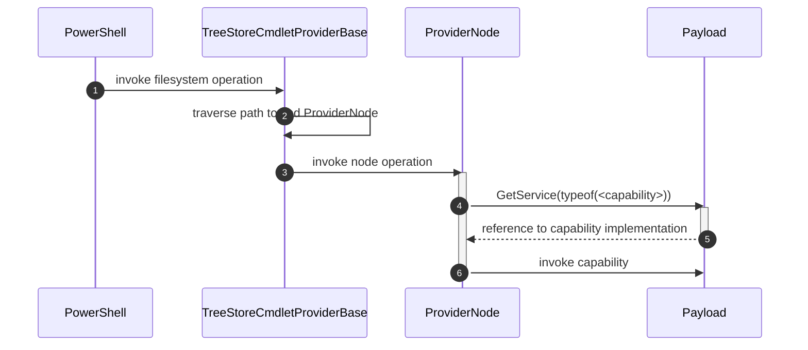

# TreeStore.Core

A C# Framework to help building PowerShell Command providers. 

## Building the project
Simply build the solution. 

The project references  a current version of `System.Management.Automation` instead of the `PowerShellStandrad.Library`. The project also targets net6.0 instead netstatdrd2.0 and is therefore not portable between PS 5.1 and PS 7. Support the old platform would require to change the code from C# 10 to C# 7.3 which is quiet some work. 

For PowerShell Debugging the PowerShell project is referenced as a submodule. This can be enabled by uncommenting the section in [TreeStore.Core](src/TreeStore.Core/TreeStore.Core.csproj). 

## Core Concepts

### The Cmdlet Provider

The provider (implemented by [TreeStoreCmdletProviderBase](./src/TreeStoreCmdletProviderBase/Providers/PowershellFileSystemDriveInfo.cs)) inherits from PowerShells `NavigationCmdletProvider` which enables the use of all item Cmdlets PowerShell provides for file system access.

In addition it implements the `IDynamicPropertyCmdletProvider` which enables interaction with dynamic properties (`New-,Remove-,Copy- and Move-ItemProperty`) and `IPropertyCmdletProvider` for non-dynamic item property interaction.

The provider is only meant to be a base for a new custom provider and doesn't implements a working file system itself. The sample implementation of [DictionaryFS](./src/TreeStore.DictionaryFS/readme.md) shows how a file system may reuse it parts from the base provider.

### Path Traversal and Provider Nodes

A file system is a hierarchical data structures made from `ProviderNode` instances. Each node has a reference to a user provider data structure called 'payload'. Each payload instance may decide dynamically if it provides an implementation of a file system operation. Read more about [./src/TreeStore.Core/Nodes](src/TreeStore.Core/Nodes/readme.md).

TreeStore.Core simply traverses the path and delegates the execution of the operation to the  identified node:


1. PowerShell invokes a file system operation at the provider with a relative or absolute path(s)
2. `TreeStoreCmdletProviderBase` traverses the path to identify the designated file system node to address. For most operations this is the actual node identified by the paths but some operations like container cmdlets e.g.  `Move-, Copy-, Remove-Item` the parent of the node is addressed as the the 'owner' of its child nodes.
3. The identified node is invoked to perform the file system operation. The provide node will check if its payload implements the capability to handle the file system operation.
4. The capability is invoked 

### Provider Node Capabilities
Starting with the root node a implementation of a `IServiceProvider` has to be provided.

If a nodes operation is called by the PowerShell provider the provider node will ask the payloads service provider for the required capability interfaces to process the invocation.
If the capability was provided it is called otherwise the node defaults.

The implementation pattern for payload looks like this:

```csharp
class Payload : IServiceProvider, 
    IGetChildItem // <- as an example of 'Capabilities'
{
    // implement IServiceProvider

    public object? GetService(Type serviceType)
    {
        if (this.GetType().IsAssignableTo(serviceType))
            return this;
        else return null;
    }

    // implement a provider node capability (doesn't has to be an explicit interface implementation)

    bool IGetChildItem.HasChildItems() {..}

    IEnumerable<ProviderNode> IGetChildItem.GetChildItems() {..}
}
```

Read more about the capabilities at [./src/TreeStore.Core/Capabilities](./src/TreeStore.Core/Capabilities/readme.md).

The sample file system  ['DictionaryFS'](src/TreeStore.DictionaryFS/readme.md) provides a documented example how to implement a provider using TreeStore.Core based on nested `IDictionary<string,object>` instances.

This file system is also used to write integration tests for the provider logic in `./test/TreeStore.DictionaryFS.Test`.

