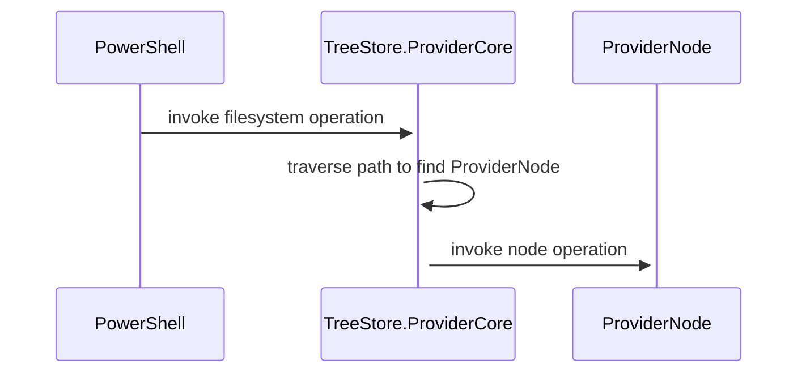

# TreeStore.ProviderCore

A C# Framework to help building PowerShell Command providers.

## Core Concepts

### The Cmdlet Provider

The provider (implemented by [PowerShellFileSystemProviderBase](./src/PowerShellFilesystemProviderBase/Providers/PowershellFileSystemDriveInfo.cs)) inhertis from PowerShells `NavigationCmdletProvider` which enables the use of all item Cmdlets powershell provides for file system access.

In addition it implements the `IDynamicPropertyCmdletProvider` which enables interaction with dynamic properties (New-,Remove-,Copy- and Move-ItemProperty) and `IPropertyCmdletProvider` for non-dynamic item property interaction.

The provider is only meant to be a base for a custom provider and doesn't implements a working file system itself.
The sample implementation of [DictionaryFS](./src/TreeStore.DictionaryFS/readme.md) shows how a file system may reuse it parts from the base provider.

### Path Traversal and Nodes

The provider bases doesn't implement file system operation itself but delegates the operations to the file system nodes.

It resolves the path given by the PowerShell command to identify the node that implements the operation invoked.
During a path traversal starting at the root node child nodes are temporarily created.



If a destination node was identified with a path the operations implementation is invoked at the node. Similar to the provider itself the node classes have a baked in default behavior which makes the operation fail if its not backed by the nodes payload.

The nodes payload is where the custom file system behavior is implemented.

### Provider Node Capabilities

Starting with the root node a implementation of a `IServiceProvider` has to be provided.

If a nodes operation is called by the powershell provider the provider node will ask the payloads service provider for the required capability interfaces to process the invocation.
If the capability was provided it is called otherwise the node defaults.

The implementation pattern for payload looks like this:

```csharp
class Payload : IServiceProvider, 
    IGetChildItem // <- as an example of 'Capabilities'
{
    // implement IServiceProvider

    public object? GetService(Type serviceType)
    {
        if (this.GetType().IsAssignableTo(serviceType))
            return this;
        else return null;
    }

    // implement a provider node capability (doesn't has to be an explicit interface implementation)

    bool IGetChildItem.HasChildItems() {..}

    IEnumerable<ProviderNode> IGetChildItem.GetChildItems() {..}
}
```

Read mor about the capabilities at [./src/TreeStore.Core/Capabilities](./src/PowershellFileSystemProviderBase/Capabilities/readme.md)

The sample file system  ['DictionaryFS'](src/TreeStore.DictionaryFS/readme.md) shows an implementation of the provider node capabilities and a `IServiceProvider` using nested 'IDictionary<string,object>' instances.
This file system is also used to write integration tests for the provider logic.
