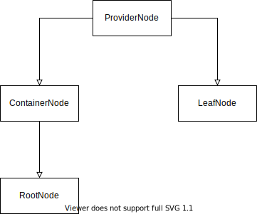

# Nodes of PowershellProviderBase

The PowerShell provider base traverses a path to find a node instance.

The nodes types are implemented as immutable [C# records](https://docs.microsoft.com/de-de/dotnet/csharp/language-reference/builtin-types/record).
Their state must not change and except of the root node they live only as long as the path is traversed.

The responsibility of the node is to process the command which was invoked at the PowerShell in context of the node which was selected by the path which was part of the command invocation.

Each node is initialized with a name and custom payload which defines the nodes capabilities.

> **The name must not change during the lifetime of the node and neither may the semantic of the node change (container or leaf)**

The payload must implement the interface [IServiceProvider](https://docs.microsoft.com/en-us/dotnet/api/system.iserviceprovider).
When called the node will ask for at least one of the [capabilities](../Capabilities/readme.md) represented by the interfaces below.

- IClearItem
- IClearItemProperty
- ICopyChildItem
- ICopyChildItemRecursive
- ICopyItemProperty
- IGetChildItem
- IGetChildItems
- IGetItem
- IGetItemProperty
- IInvokeItem
- IItemContainer
- IItemExists
- IMoveChildItem
- IMoveItemProperty
- INewChildItem
- INewItemProperty
- IRemoveChildItem
- IRemoveItemProperty
- IRenameChildItem
- IRenameItemProperty
- ISetItem
- ISetItemProperty

If the nodes service provider delivers an instance of these service types it will be called otherwise the node will fall back to its default behavior.