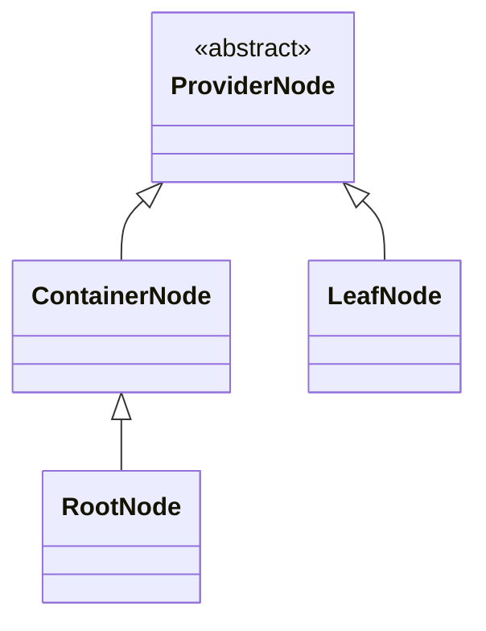

# Provider Nodes

The PowerShell provider base traverses a path to find a node instance representing the file system item identified by the path. 



The nodes types are implemented as immutable [C# records](https://docs.microsoft.com/de-de/dotnet/csharp/language-reference/builtin-types/record) and have a common base class [ProviderNode](./ProviderNode.cs). Their state must not change and except of the root node they live only as long as the path is traversed.

The responsibility of the node is to process the command which was invoked at the PowerShell in context of the node which was selected by the path which was part of the command invocation. Each node is initialized with a name and custom payload which defines the nodes capabilities.

## Creation of Node Instances
Starting at the root node child nodes are as instance of `ContainerNode` or `LeafNode`. To create a node specify its name and a payload:

```CSharp
var containerNode = new ContainerNode("<node name>", <payload>)
```
> [!NOTE] The name must not change during the lifetime of the node and neither may the semantic of the node change (container or leaf)
> Its OK if payloads parent creates the node during the next traversal with a new name. TreeStore.Core doesn't remember the name.

## Implementing TreeStore Capabilities

The payload doesn't have to implement the capability interfaces by itself. It only has to implement  [IServiceProvider](https://docs.microsoft.com/en-us/dotnet/api/system.iserviceprovider): 

```csharp
class ExamplePayload : IServiceProvider
{
	public object GetService(Type capabilityType) => ...
}
```

When called the node will ask with `GetService(typeof(<capability>)` for at least one of the [capabilities](../Capabilities/readme.md) represented by the interfaces below.

- IClearItem
- IClearItemProperty
- ICopyChildItem
- ICopyChildItemRecursive
- ICopyItemProperty
- IGetChildItem
- IGetChildItems
- IGetItem
- IGetItemProperty
- IInvokeItem
- IItemExists
- IMoveChildItem
- IMoveItemProperty
- INewChildItem
- INewItemProperty
- IRemoveChildItem
- IRemoveItemProperty
- IRenameChildItem
- IRenameItemProperty
- ISetItem
- ISetItemProperty

If the nodes service provider delivers an instance of these service types it will be called otherwise the node will fall back to its default behavior. Capability are explained at [../Capabilities](../Capabilities/readme.md)
