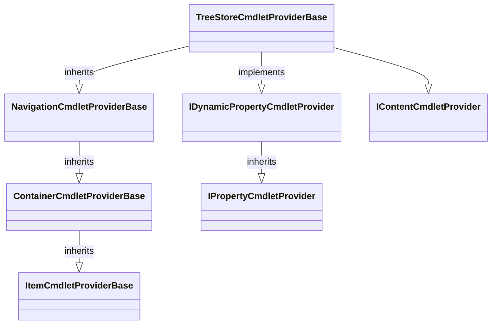

# TreeStore Provider and DriveInfo

The `TreeStoreCmdletProviderBase` inherits from PowerShells most feature rich CmdletProvider base class: [`NavigationCmdletProvider`](https://docs.microsoft.com/en-us/dotnet/api/system.management.automation.this.CmdletProvider.navigationcmdletprovider). It also implements the optional CmdletProvider features for static and dynamic (create/remove) item properties (`IPropertyCmdletProvider` and `IDynamicPropertyCmdletProvider`). It also supports the `IContentCmdletProvider`.



Implementing these features enables the corresponding commandlets in PowerShell. TreeStore maps these provider types and capabilities to [node capabilities](src/TreeStore.Core/Capabilities/readme.md) implemented by each single node represening a file system item..

The drives state is stored in an instance of type [`PSDriveInfo`](https://docs.microsoft.com/en-us/dotnet/api/system.management.automation.psdriveinfo) from this class `TreeStoreDriveInfoBase` is derived. It extends the state of the drive info with a single delegate for creating the root nodes payload:

```csharp
public abstract class TreeStoreDriveInfoBase : PSDriveInfo
{
	protected TreeStoreDriveInfoBase(PSDriveInfo driveInfo, Func<string, IServiceProvider> rootNodeProvider)
		: base(driveInfo)
	{
		this.rootNodeProvider = rootNodeProvider;
	}

	private readonly Func<string, IServiceProvider> rootNodeProvider;

	public RootNode RootNode => new RootNode(this.rootNodeProvider(this.Name));
}
```

This is an important 'hinge' for connecting the TreeStore file system CmdletProvider with the custom payload data. The name given to the delegate is the name of the drive used by the PowerShell to identify the drive. While the TreeStores CmdletProvider doesn't have to be overridden the drive info must be. 

Continue reading in [src/TreeStore.Core/readme](src/TreeStore.Core/Providers/readme.md)

