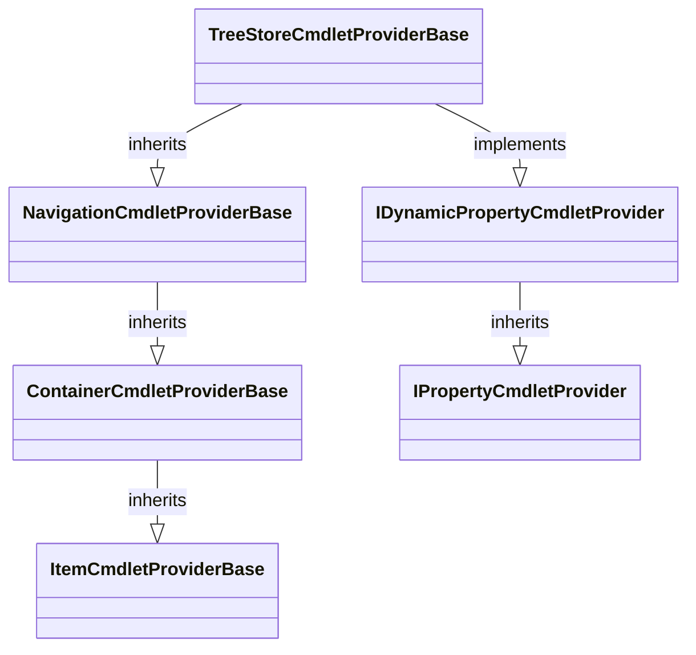

# TreeStore Provider and DriveInfo

The `TreeStoreCmdletPÜroviderBase` inherits from PowerShells most feature rich provider base class: [`NavigationCmdletProvider`](https://docs.microsoft.com/en-us/dotnet/api/system.management.automation.provider.navigationcmdletprovider). It also implements the optional provider features for static and dynamic (create/remove) item properties. 


Implementing these features means to enable the corresponding commandlets in PowerShell. It doesn't require a user of TreeStore to provide payloads accepting these file system operations. If the corresponding capabilities aren't provided by a nodes payload the provider will fall back to its default behavior which means it will return an error to the caller.

The drives state is stored in an instance of type [`PSDriveInfo`](https://docs.microsoft.com/en-us/dotnet/api/system.management.automation.psdriveinfo) from this class `TreeStoreDriveInfoBase` is derived. It extends the state of the drive info with a single delegate for creating the root nodes payload:

```csharp
public abstract class TreeStoreDriveInfoBase : PSDriveInfo
{
	protected TreeStoreDriveInfoBase(PSDriveInfo driveInfo, Func<string, IServiceProvider> rootNodeProvider)
		: base(driveInfo)
	{
		this.rootNodeProvider = rootNodeProvider;
	}

	private readonly Func<string, IServiceProvider> rootNodeProvider;

	public RootNode RootNode => new RootNode(this.rootNodeProvider(this.Name));
}
```

This is an important 'hinge' for connecting the TreeStore file system provider with the custom payload data. The name given to the delegate is the name of the drive used by the PowerShell to identify the drive. While the TreeStore provider doesn't have to be overridden the drive info must be. 