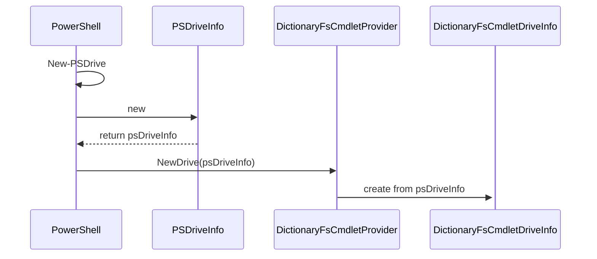

# DictionaryFS

A sample file system base of TreeStore.Core. 

## Setting up the Project
The file system module is set up as as C# class lib. At the same level a directory to implement a test project. 

```powershell
mkdir TreeStore.DictionaryFS
cd TreeStore.DictionaryFS
dotnet new classlib
```

The PowerShell module depends on TreeStore.Core. Dependencies from PowerShells are resolved by adding the TreeStore package.

```PowerShell
dotnet add package TreeStore.Core
```

For the test project:

```powershell
mkdir TreeStore.DictionaryFS.Test
cd TreeStore.DictionaryFS.Test
dotnet new xunit
```

As a dependency the main project must be added and the PowerShell SDK for hosting:

```Powershell
dotnet add reference ../TreeStore.DictionaryFS
ditnet add package Microsoft.PowerShell.SDK
```

Now you may add a solution to the project, add the projects and continue in visual studio or an other IDE of your choice.

## Creating the Provider and the Drive Info
Two classes have to be created for a new filesystem command provider:

1. The provider itself: It is annotated with a unique descriptor and may publish additional [provider capabilities](https://docs.microsoft.com/en-us/dotnet/api/system.management.automation.provider.providercapabilities). Currently TreeStore doesn't help with providing any of these capabilities yet. which is why we declare `ProviderCapabilities.None`. The provider class also knows how to create a instance of the second class to build.
2. The drive info: The custom drive info class derived from PowerShells [PSDriveInfo](https://docs.microsoft.com/en-us/dotnet/api/system.management.automation.psdriveinfo) class holds the state of the drive. PowerShell will keep the instance of the drive info as long the the drive isn't removed. It is created from an instance of the `PSDiveInfo` class given the to providers method `NewDrive` and contains the parameters which were given to PowerShell `New-Drive` command. 

The most vital  information in respect to TreeStore kept by in the DriveInfo is how to get access to the root node of the file system data. Please refer to the files [DictionaryFsCmdletProvider](DictionaryFsCmdletProvider.cs) and [DictionaryFsDriveInfo](DictionaryFsDriveInfo.cs) for complete examples.




## Create a Test Skeleton for the Cmdlet Provider
The test project for the DictionaryFS provides a base class for xunit tests which contains the common code to arrange a dictionary file system to run tests against. The common code includes:
- Create a PowerShell instance to be used in each test case [PowerShellTestBase](../../test/TreeStore.DictionaryFS.Test/PowerShellTestBase.cs).
- Loading of the PowerShell module and creation of a drive to test in: [ItemCmdletProviderTestBase](../../test/TreeStore.DictionaryFS.Test/ItemCmdletProvider/ItemCmdletProviderTestBase.cs)

Having a setup like this event allows to continue the work with a test first approach. A simple test may no look like this:
- a file system is created with the given root data (`new UnderlyingDictionary()`)
- a PowerShell command is invoked
- the result is read from the pipeline and validated

```Csharp
[Fact]
public void Powershell_reads_root_node()
{
	// ARRANGE
	this.ArrangeFileSystem(new UnderlyingDictionary());

	// ACT
	var result = this.PowerShell.AddCommand("Get-Item")
		.AddParameter("Path", @"test:\")
		.Invoke()
		.ToArray();

	// ASSERT
	Assert.False(this.PowerShell.HadErrors);

	var psobject = result.Single();

	Assert.Equal("test:", psobject.Property<string>("PSChildName"));
	Assert.True(psobject.Property<bool>("PSIsContainer"));
	Assert.Equal("test", psobject.Property<PSDriveInfo>("PSDrive").Name);
	Assert.Equal("DictionaryFS", psobject.Property<ProviderInfo>("PSProvider").Name);
	Assert.Equal(@"TreeStore.DictionaryFS\DictionaryFS::test:\", psobject.Property<string>("PSPath"));
	Assert.Equal(string.Empty, psobject.Property<string>("PSParentPath"));
}
```

> [!NOTE] A PowerShell instance can't be used concurrently
> To make sure that the PowerShell instance isn't used in test running parallel all test are member of a test collection: `[Collection(nameof(PowerShell))]`

## DictionaryContainerAdapter implements IServiceProvider
The center piece of the sample file system is the adapter class ['DictionaryContainerAdapter'](Nodes/DictionaryContainerAdapter.cs).

The adapter class treats all key-value-pairs which have a value that can be cast to `IDictionary<string,object?>` as a child node.
All other key-value-pairs are properties of the file system item.
The filesystem uses only container nodes, Leaf nodes aren't supported.

The implementation of the `IServiceProvider` interface is simple.
If the requested type is assignable from `this`, the references of the adapter is returned as implementation of the requested service:

```Csharp
public object? GetService(Type serviceType)
{
    if (this.GetType().IsAssignableTo(serviceType))
        return this;
    else return null;
}
```

All [TreeStore capabilities](../TreeStore.Core/Capabilities/readme.md) are implemented as explicit interface implementations.
As an example the implementation of `IGetItem`:

```Csharp
PSObject? IGetItem.GetItem()
{
    var pso = new PSObject();
    foreach (var item in this.Underlying)
        pso.Properties.Add(new PSNoteProperty(item.Key, item.Value));
    return pso;
}
```

The DictionaryFS example doesn't make use of dynamic parameters. It relies on the default implementations of the capability interfaces. For `IGetItem` the implementation can be found in [IGetItem.cs](../TreeStore.Core/Capabilities/IGetItem.cs) and it look like this:

```Csharp
object? GetItemParameters() => new RuntimeDefinedParameterDictionary();
```

Alternatively you may just return `null`.

To provide a dynamic parameters for an operation you have to override these methods and return a populated [RuntimeDefinedParameterDictionary](https://docs.microsoft.com/en-us/dotnet/api/system.management.automation.runtimedefinedparameterdictionary). Alternativly a class with annotated properties may be returned:

```csharp
public class Parameters 
{
    [Parameter()]
    public string Parameter1 { get; set; }
}
```
