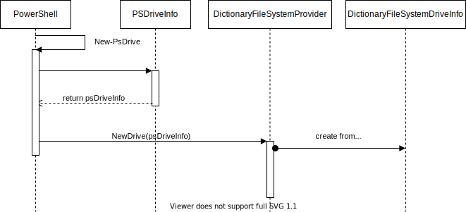

# DictionaryFS

A sample file system base of TreeStore.Provider.Core.

## DictionaryContainerAdapter as implementation of IServiceProvider

The center piece of the sample file system is the adapter class ['DictionaryContainerAdapter'](Nodes/DictionaryContainerAdapter.cs).

The adapter class teats all key-value-pairs which have a value that can be cast to ```IDictionary<string,object?>``` as a child node.
All other key-value-pairs are properties of the file system item.
The filesystem uses only container nodes, Leaf nodes aren't created.

The implementation of the IServiceProvider-interface is simple. If the requested type is assignable to from this,
the references of the adapter is returned as implementation of the requested service:

```Csharp
public object? GetService(Type serviceType)
{
    if (this.GetType().IsAssignableTo(serviceType))
        return this;
    else return null;
}
```

All TreeStore capabilities are implemented as explicit interface implementations. As Example the implementation of ```IGetItem```:

```Csharp
PSObject? IGetItem.GetItem()
{
    var pso = new PSObject();
    foreach (var item in this.Underlying)
        pso.Properties.Add(new PSNoteProperty(item.Key, item.Value));
    return pso;
}
```

The DictionaryFS example make no use of dynamic parameters. It relies on the default implementations of the capability interfaces. For ```IGetItem``` the implementation can be found in [IGetItem.cs](../PowerShellFilesystemProviderBase/Capabilities/IGetItem.cs) and it look like this:

```Csharp
object? GetItemParameters() => new RuntimeDefinedParameterDictionary();
```

Alternatively you may just return ```null```.

To provide a dynamic parameters for an operation you have to override these methods and return a populated [RuntimeDefinedParameterDictionary](https://docs.microsoft.com/en-us/dotnet/api/system.management.automation.runtimedefinedparameterdictionary) or a class with annotated properties.

## Creation of a new Drive and the Drives State

Two additional mandatory parts of a file system are [DictionaryFileSystemProvider](./DictionaryFilesystemProvider.cs) and [DictionaryFileSystemInfo](./DictionaryFileSystemDriveInfo.cs)



The file system provider inherits from the TreeStore provider core and overrides the method which is called when a new file system is mounted.
The received generic ```PSDriveInfo``` contains the parameters of the powershell ```New-PSDrive``` command and is used to initialize the custom ```DictionaryFileSystemInfo```.

The ```DictionaryFileSystemInfo``` is the state of the drive and is preserved by the PowerShell process.
It also holds a copy of the root node provider delegate to be able to instantiate the root node of the file system to start a traversal of a requested path.
